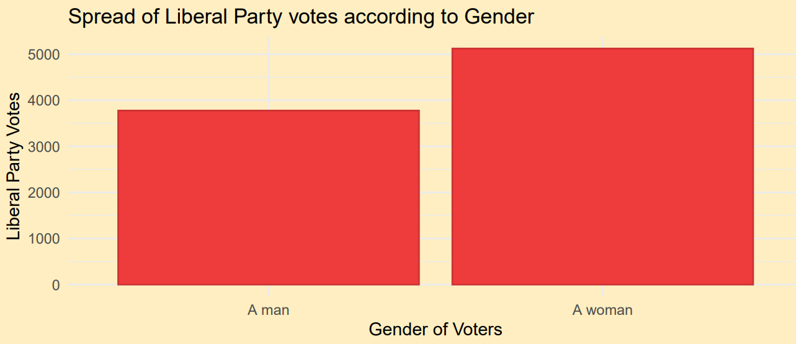
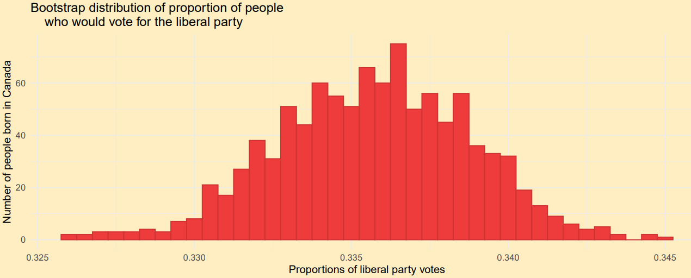
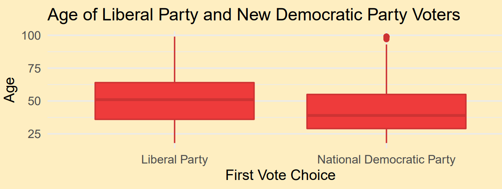
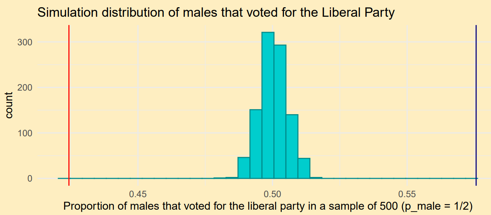

# Analysing Voter Demographics

<!-- TABLE OF CONTENTS -->

  
Table of Contents

  <ol>
    <li>
      <a href="#about-the-project">About The Project</a>
      <ul>
        <li><a href="#built-with">Built With</a></li>
        <li><a href="#data">Data</a></li>
      </ul>
    </li>
    <li><a href="#statistical-methods">Statistical Methods</a></li>
    <li><a href="#visualizations">Visualizations</a></li>
    <li><a href="#contributers">Contributers</a></li>
  </ol>

<!-- ABOUT THE PROJECT -->
## About The Project
Data analytics are a large part of decisions made by politicians and political parties. Here, we use R and statistical analysis methods to provide key insight to the Liberal Party about their current standing in voter opinions. We use past data and manipulate it to make predictions on the Liberal party's voter demographics. The three questions answered in this project are the following;

1. What percentage of votes should the Liberal party expect from people born in Canada during the election at this point in time?

2. Is the proportion of male people who voted for the Liberal Party 50%?

3. What is the range of plausible values of the difference in median age of Canadians who would vote for the Liberal party verses the National Democratic Party as their first choice?

### Built With

* [R](https://www.r-project.org/)
* [RStudio](https://www.rstudio.com/)

### Data
* [Canadian Election Study 2019](http://www.ces-eec.ca/)
The data set used in this analysis is from the 2019 Online Canadian Election Survey with a representative sample of 25850 of the population of eligible voters in Canada. 

(<a href="#top">back to top</a>)

<!-- Statistical Techniques -->
## Statistical Methods

- [ ] Data Wrangling
    - [ ] filtering
    - [ ] grouping
    - [ ] mutating variables
- [ ] Bootstrapping
    - [ ] drew 1000 bootstrap samples from original sample to explore variability from the original sample to create a range of plausible values
- [ ] One-sample Hypothesis Test
    - [ ] tested the null hypothesis against the alternative hypothesis to see how unlikely it is that the result occoured by chance
- [ ] Confidence Intervals
    - [ ] created several 95% confidence intervals to determine a range of values that would contain value 95% of the time

For more information, see [Voter Demographics.pdf](https://github.com/hashimr1/Analysing-Voter-Demographics/blob/main/Voter%20Demographics.pdf)

(<a href="#top">back to top</a>)

## Visualizations
Visulizations of the data created using R include bar graphs, histograms and box plots. 

(<a href="#top">back to top</a>)

<!-- CONTRIBUTERS -->
## Contributers

- Raazia Hashim
- Chetanya Saxena
- Maryam Ansari
- Suchi Aidasani

[STA130 - An Introduction to Statistical Reasoning and Data Science](https://artsci.calendar.utoronto.ca/course/sta130h1)

(<a href="#top">back to top</a>)

